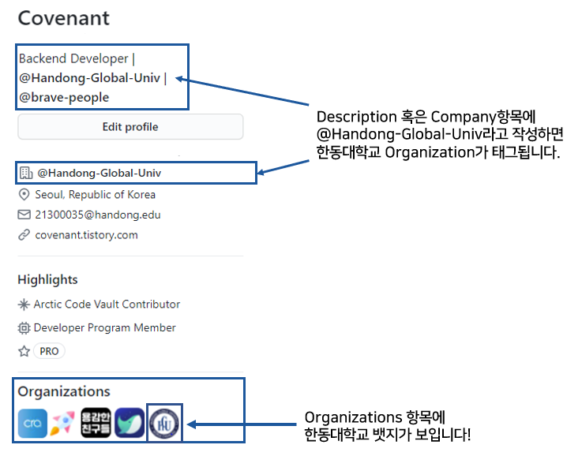
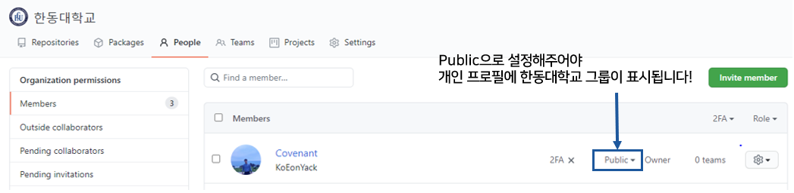

  

> 한동대학교 Github Organization에 오신것을 환영합니다!

## Handong-edu Organization 목적?

- Github 프로필 Company 항목에 텍스트로 Handong Global University로 쓰는 것이 아니라 @ 태그를 통해서 한동대학교 학생임을 보여줄 수 있도록 Organization을 만들었습니다. 
- 저학년의 경우 Handong-edu에 가입한 고학년 그리고 현업에서 일하고 있는 선배 한동인들의 활동을 보면서 많은 배움의 기회가 될 것입니다.
- handong-global-university, handong-university가 이미 사용중이며 관리되지 않은 Organization 이름이여서 handong-edu로 만들게 되었습니다.

  

 

## 그룹 가입 방법

### STEP 1. 신청 이메일을 보내주세요!

- 한동대학생 인증을 위해서 HGU 계정 이메일로 21300035@handong.edu로 보내주세요!
- 졸업생이여서 HGU 계정이 비활성화된 경우 한동대 졸업을 인증할수 있는 다양한 방법으로 21300035@handong.edu로 메일을 보내주세요!
    - 뉴턴홀의 전 이름은 ***이었다. 와 같이 찐 졸업생만이 아는 정보를 담아서 메일을 보내주세요!

### STEP 2. 초대 매일을 수락하고나서

- Public으로 설정해주셔야 Github 개인 프로필에서 한동대학교 로고가 보입니다.

 
 
 

Why not change the world?

Handong God's University

  

